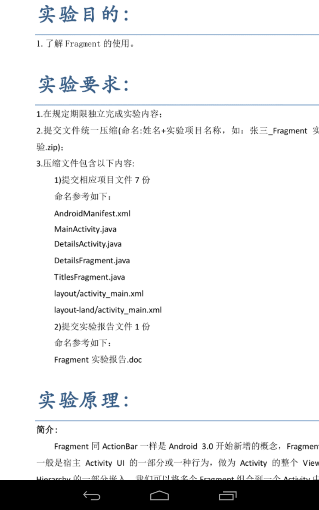
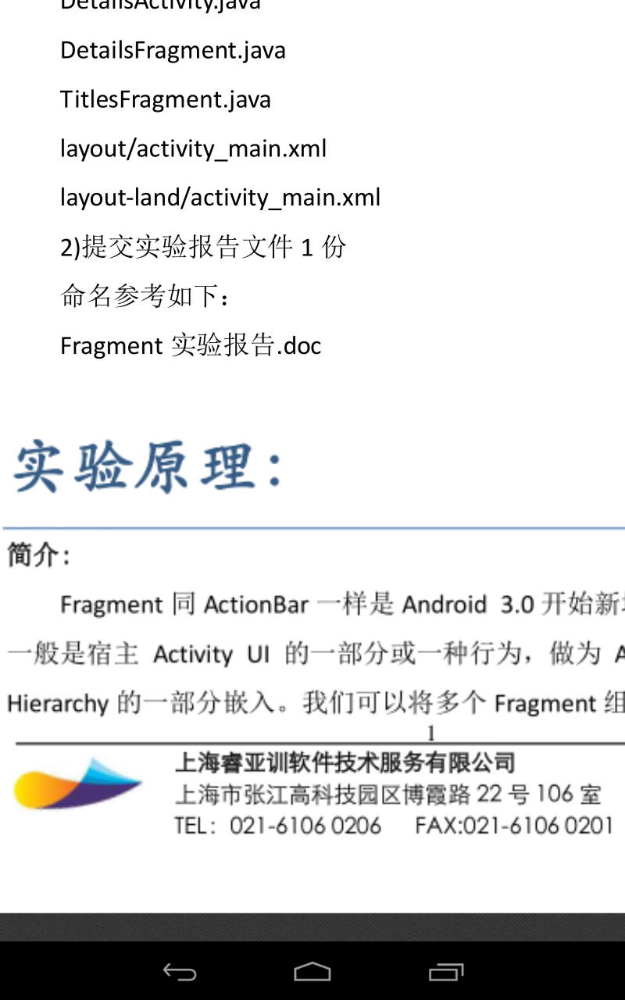
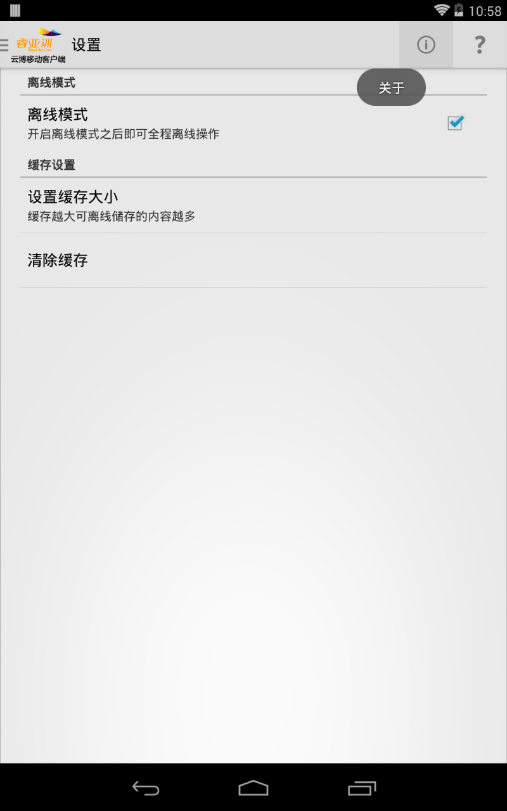
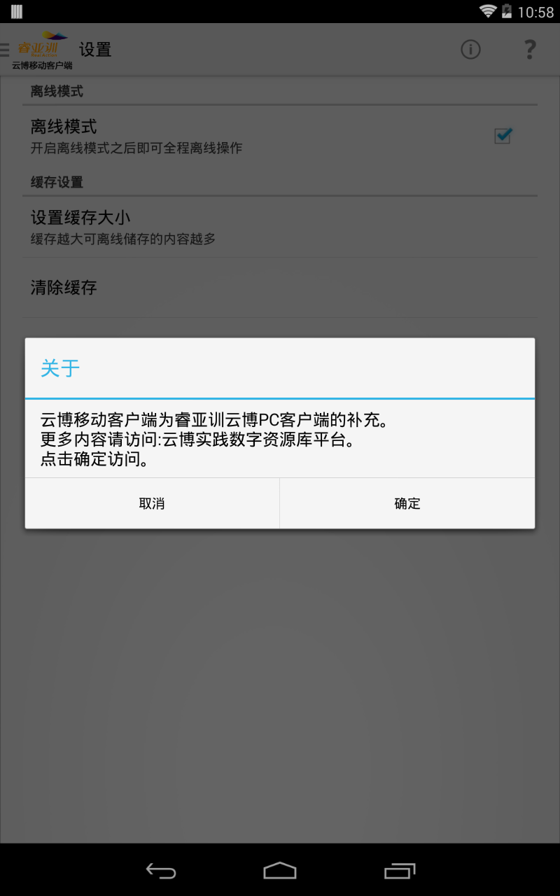

#睿亚训云博移动客户端帮助文档#
---
###云博移动客户端概述###
云博移动客户端为睿亚训云博IT实践数字资源库平台PC客户端——学宝的移动补充版。具备学宝客户端的部分重要功能，方便师生随时随地查看云博平台的教学资源。

###云博移动客户端功能###
* 云博平台用户可直接登陆，用户名密码与云博平台一致；
* 用户名和密码记录功能，方便二次登陆；
* 用户课程列表、课程案例列表查看功能；
* 课程案例教学资源查看功能，可直接查看案例资源的实验指导书、实验答案等文档或视频资源；
* 最常浏览和历史记录功能，方便快速查看最常浏览的案例和最后浏览的案例；
* 具备离线功能，可记录登陆过的用户及其查看过的资源，在断网情况下依旧可以查看已缓存过的资源；
* 具体离线缓存空间自动清理功能，当缓存容量超出设定值之后会自动清除以节省空间；
* 应用程序具备自动升级功能，会自动提示用户是否升级到最新版本；

###云博移动客户端使用图文指导###

如下图所示，输入用户名、密码之后，点击“登陆”按钮即可登陆

####首页####
如下图所示，成功登陆之后会首先看到一个指导界面，该界面用来说明如何调出菜单，通过点击左上角应用Logo图片或者从屏幕左边沿向右边滑动即可调出菜单

点击“知道了”按钮之后可以看到“首页”界面，该界面可以看到登陆的用户信息和最常浏览和历史记录信息

####我的课程####
通过滑动屏幕调出菜单，点击“我的课程”按钮即可进入课程列表界面

####案例列表####
点击某一门课程，即可进入课程案例列表界面

####案例详细信息####
案例列表点击某一个案例之后会进入到案例资源详细信息界面

点击“查看指导书”或“查看答案”按钮即可进入指导书或答案查看界面

####资源查看####
指导书或答案界面以列表的形式展示教学资源，如果是目录则点击之后会进入目录，如果是可查看的资源则点击之后会在新界面显示该资源，点击列表最上方蓝色背景的返回按钮可以返回上层目录

查看教学案例资源的时候可以拖动或缩放

####返回上一界面####
在各个界面点击左上角的Logo即可返回上一个界面，功能同Back键

####设置####
切换至“设置”界面

设置缓存大小，缓存越大可离线缓存的资源越多

清除缓存功能，可清楚已缓存的内容

####关于####
“关于”菜单按钮，点击确定按钮可以打开浏览器跳转到云博介绍页面

####帮助####
“帮助”菜单按钮，点击之后跳转到云博移动客户端使用帮助文档界面

####退出####
退出提示对话框

